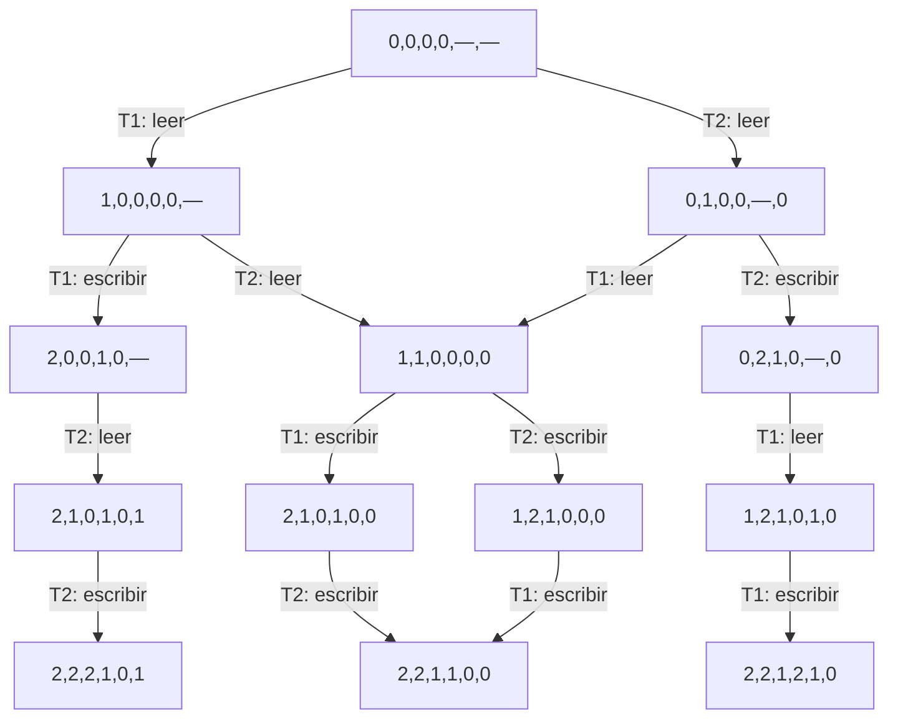

# Guía 1 resuelta — Modelo de cómputo y exclusión mutua

Fuente: [transcripción de la guía](guia-01-modelo-de-computo-y-exclusion-mutua.transcripcion.md). Apoyo: [clase práctica 1](../clases-practicas/practica-01-introduccion-semantica-y-java.transcripcion.md), especialmente pp. 12–17, 27 y 32. Soluciones elaboradas para estudiar; no son soluciones oficiales.

## Convenciones

Memoria secuencialmente consistente, enteros matemáticos sin overflow. Leer una variable compartida y escribir otra son pasos diferentes: `y=x+1` se expande en `r=x; y=r+1`, como en la p. 27 de la práctica. El cálculo sobre el temporal privado se incorpora al paso de escritura; separarlo introduce estados locales intermedios pero no nuevos resultados compartidos. Una guarda booleana es un paso de evaluación; no se hace atómico el cuerpo del `while`.

Los estados incluyen memoria, contadores de programa y temporales. Al hablar de progreso se supone scheduler débilmente justo, operaciones locales terminantes y secciones críticas finitas. Esto no convierte una elección que se habilita sólo intermitentemente en una elección obligatoria.

## Ejercicio 1 — Semántica y diagramas completos

Escribimos `σ[v↦a]` para actualizar el estado, y damos la semántica concurrente como **conjunto de estados finales posibles**. `⊥` representa divergencia.

### a) Copiar x en y y copiar y en x

Sean `a=σ(x)`, `b=σ(y)`:

- `⟦T1⟧σ = σ[y↦a]`.
- `⟦T2⟧σ = σ[x↦b]`.
- `⟦T1|T2⟧σ = {σ[x↦a,y↦a], σ[x↦b,y↦b], σ[x↦b,y↦a]}`.

El tercer resultado ocurre si ambos leen antes de que cualquiera escriba. Para `(x,y)=(1,2)`, los finales son `(1,1)`, `(2,2)` y `(2,1)`.

En el diagrama, cada nodo muestra `(pc1,pc2,x,y,r1,r2)`: `pc=0` antes de leer, `1` antes de escribir, `2` terminado; `—` indica temporal aún no definido. Se conservan los temporales incluso en estados finales.


### b) Copiar con incremento

- `⟦T1⟧σ = σ[y↦a+1]`.
- `⟦T2⟧σ = σ[x↦b+1]`.
- `⟦T1|T2⟧σ = {σ[x↦a+2,y↦a+1], σ[x↦b+1,y↦b+2], σ[x↦b+1,y↦a+1]}`.

Para el estado inicial `(0,0)`, los resultados son `(2,1)`, `(1,2)` y `(1,1)`. En las aristas de escritura se suma uno al temporal leído.



### c) Un hilo incrementa y hasta que el otro cambia x

Secuencialmente:

```text
⟦T1⟧σ = σ, si σ(x) >= 1; ⊥, si σ(x) < 1.
⟦T2⟧σ = σ[x↦1].
```

Concurrentemente, con justicia débil:

```text
si σ(x) >= 1: { σ[x↦1] }
si σ(x) <  1: { σ[x↦1, y↦σ(y)+k] : k >= 0 }
```

Sin justicia se agrega divergencia en el segundo caso: T2 podría no ejecutarse nunca. Con justicia T2 escribe `x=1` eventualmente; T1 completa, a lo sumo, el cuerpo que ya había habilitado y termina.

El grafo es infinito. Esta es una **descripción completa mediante familias de nodos y aristas**, para el estado inicial `x=y=0`. `b∈{0,1}` dice si T2 ya escribió (`x=b`), `k=y`, y los nodos de T1 son `G` (guarda), `R` (lectura de y), `W` (escritura, con temporal `r=k`) y `D` (terminado):

| Origen | Acción | Destino | Rango |
|---|---|---|---|
| `G₀(k)` | T1: guarda verdadera | `R₀(k)` | `k≥0` |
| `R_b(k)` | T1: `r=y` | `W_b(k)` | `b=0,1; k≥0` |
| `W_b(k)` | T1: `y=r+1` | `G_b(k+1)` | `b=0,1; k≥0` |
| `G₁(k)` | T1: guarda falsa | `D₁(k)` | `k≥0` |
| `G₀(k)` | T2: `x=1` | `G₁(k)` | `k≥0` |
| `R₀(k)` | T2: `x=1` | `R₁(k)` | `k≥0` |
| `W₀(k)` | T2: `x=1` | `W₁(k)` | `k≥0` |

Inicial: `G₀(0)`. Finales: todos los `D₁(k)`. No existen más aristas. Los temporales muertos se omiten; incluir su valor anterior sólo subdivide estados observacionalmente equivalentes.

## Ejercicio 2 — Incrementos perdidos

Denotar `Rᵢ(v)` la lectura de n por Ti y `Wᵢ(v+1)` su escritura posterior. Los incrementos no son atómicos.

### a) Dos trazas con resultado 2K

1. T1 ejecuta sus K incrementos completos y después T2 los suyos.
2. T2 ejecuta sus K incrementos completos y después T1 los suyos.

También sirve alternar incrementos **completos**. Para `K=0` sólo existe la ejecución vacía: el pedido de dos trazas distintas presupone `K>0`.

### b) Resultado K

Repetir K veces, para `v=0,…,K−1`:

```text
R1(v); R2(v); W1(v+1); W2(v+1)
```

En cada ronda dos incrementos producen un único aumento visible.

### c) ¿Puede ser menor que K?

**Sí, si K≥3. Incluso puede terminar en 2.** Traza:

1. T1 lee `n=0` en su primer incremento y queda suspendido antes de escribir.
2. T2 completa sus primeros `K−1` incrementos: `n=K−1`.
3. T1 escribe su valor atrasado `1`.
4. T2 lee `1` para su último incremento y queda suspendido.
5. T1 completa sus restantes `K−1` incrementos: `n=K`.
6. T2 escribe `2` y termina; T1 ya terminó.

Para `K=1` el mínimo es 1; para `K≥2` es 2. Justificación de esta última cota: una escritura de 1 requiere haber leído el 0 inicial, antes de cualquier escritura. Un hilo con al menos dos incrementos no puede tener esa lectura en su último incremento, porque ya hizo una escritura positiva propia. La última escritura global es el último incremento de algún hilo, luego no puede escribir 1. Para `K=0`, n queda en 0.

## Ejercicio 3 — Tres copias en ciclo

`R1/W1` leen x/escriben y; `R2/W2` leen y/escriben z; `R3/W3` leen z/escriben x. Los posibles finales `(x,y,z)` son **exactamente siete**:

| Final `(x,y,z)` | Traza testigo |
|---|---|
| `(1, 1, 1)` | `R1 W1 R2 W2 R3 W3` |
| `(2, 1, 2)` | `R1 R2 W1 W2 R3 W3` |
| `(2, 2, 2)` | `R2 W2 R3 W3 R1 W1` |
| `(3, 1, 1)` | `R1 W1 R2 R3 W2 W3` |
| `(3, 1, 2)` | `R1 R2 W1 R3 W2 W3` |
| `(3, 3, 2)` | `R2 R3 W2 W3 R1 W1` |
| `(3, 3, 3)` | `R3 W3 R1 W1 R2 W2` |

Exhaustividad: cada hilo tiene dos pasos con la restricción `Ri<Wi`. Hay `6!/(2!)³=90` intercalaciones. Al explorar todas, propagando a cada escritura el valor de su lectura, se obtienen precisamente estos siete estados. No se puede tratar cada asignación como atómica: eso eliminaría, por ejemplo, `(3,1,2)`.

## Ejercicio 4 — Tamaño del espacio de estados

### a) Cota inferior

`(K+1)^N`: cada hilo puede estar antes de su instrucción 1, entre instrucciones o terminado. Todas las combinaciones de sus avances son alcanzables si las K instrucciones son ejecutables y no bloqueantes, como presupone este modelo sin control de flujo.

No es ajustada cuando una misma tupla de posiciones de programa admite varias memorias/temporales según el orden anterior. Si los hilos escriben valores dependientes de lecturas compartidas, esto ocurre con frecuencia. Si se permitieran instrucciones bloqueantes, el producto de posiciones no sería automáticamente una cota inferior; aquí no se las supone.

### b) Trazas

Las **trazas completas de instrucciones identificadas por hilo** son:

```text
(NK)! / (K!)^N
```

Se eligen posiciones para K pasos de cada hilo manteniendo su orden interno. Distintas trazas pueden terminar en el mismo estado. Si se cuentan únicamente salidas observables, pueden ser menos.

## Ejercicio 5 — Buscar una raíz entera

Suponemos que cada evaluación de f termina. T1 explora `1,2,…`; T2 explora `0,−1,−2,…`, de modo que cubren todos los enteros.

### a) Programa A: incorrecto

Además de sobrescribir hallazgos dentro del loop, cada hilo puede reinicializar `found`. Sea `f(x)=x−1`: T1 inicializa, encuentra la raíz 1, escribe true y sale; recién entonces T2 inicializa `found=false` y busca para siempre entre los no positivos.

### b) Programa B: incorrecto

Inicializar una sola vez no alcanza. Con la misma f:

1. T2 evalúa la guarda cuando `found=false` y entra al cuerpo.
2. T1 encuentra 1, escribe true y sale.
3. T2 evalúa `f(0)`, escribe false y continúa indefinidamente.

Encontrar una raíz no debe poder ser deshecho por una búsqueda que falla.

### c) Programa C: correcto bajo los supuestos

`found` sólo cambia de false a true. Si aún no cambió, los hilos siguen explorando y la raíz aparece tras una cantidad finita de pasos de uno de ellos. Una vez true, cada hilo completa como máximo su iteración ya iniciada y sale. Justicia débil y terminación de f son necesarias para esta afirmación de terminación.

## Ejercicio 6 — Qué puede imprimir el loop

### a) El 2

Puede aparecer **cero o una vez**. Una guarda puede haber leído `n<2` antes del último incremento, y el `print` leer 2 después. La siguiente guarda es falsa y n nunca disminuye.

### b) El 1

Cualquier cantidad finita, incluido cero. Para producir m unos, ejecutar el primer incremento de T2, dejar que T1 imprima m veces y luego ejecutar el segundo incremento. Con justicia débil no puede imprimir infinitos unos: el segundo incremento está habilitado permanentemente. Sin justicia, sí podría.

### c) Longitud mínima

**0**: ejecutar ambos incrementos de T2 antes de la primera guarda de T1.

## Ejercicio 7 — Loops contrapuestos

### a) T1 ejecuta exactamente una vez

T1 evalúa `0<1`, incrementa hasta 1 y evalúa otra vez su guarda, que resulta falsa. Después T2 puede reducir n hasta −1 y terminar. Lo que haga T2 luego de que T1 haya salido no lo vuelve a activar.

### b) T1 puede no terminar

Repetir:

```text
n=0: T1 evalúa su guarda y completa el incremento => n=1.
n=1: T2 evalúa su guarda y completa el decremento => n=0.
```

Cada hilo llega siempre a su siguiente guarda cuando le conviene. Ambos hacen infinitos pasos: la ejecución es compatible con justicia débil.

## Ejercicio 8 — Alternancia y detección

### a) Finales posibles

`n∈{0,1}` siempre, y **ambos son finales posibles**.

- Final 0: el segundo hilo observa el 0 inicial y pone `flag=true` antes de que el primero entre al cuerpo.
- Final 1: el primero evalúa `!flag` y entra al cuerpo; el segundo detecta n=0 y pone flag=true; el primero completa el cambio a 1 y después sale.

### b) Ejecución infinita

Sí, aun con justicia débil: el primero alterna 0/1; programar cada comprobación `n==0` del segundo cuando n=1. Se siguen ejecutando ambos, pero nunca se establece flag. La justicia débil no obliga a detectar un estado que aparece sólo intermitentemente.

## Ejercicio 9 — Bakery sin desempate

No garantiza exclusión mutua. Desde `np=nq=0`:

1. p lee nq=0 para calcular su número.
2. q lee np=0 para calcular el suyo.
3. p escribe np=1; q escribe nq=1.
4. Ambas guardas de espera usan `>` y son falsas porque los números empatan.
5. Ambos entran a la sección crítica.

Un número de turno debe desempatarse por id; también hace falta tratar correctamente los números en proceso de elección, como hace el Bakery completo.

## Ejercicio 10 — Turnos que se reutilizan

### a) Operaciones no atómicas

p y q leen `turnos=0` en `PedirTurno`, ambos conservan `miturno=0` y realizan sus incrementos. Con `actual=0`, ambos pasan la espera: **falla exclusión mutua**.

También falla la entrada eventual: aun ejecutando las operaciones sin solapamiento, p toma 0 y libera; queda `actual=1, turnos=0`. q toma 0 y espera para siempre: nadie volverá a poner actual en 0.

### b) Operaciones atómicas

Se elimina la carrera de lectura/incremento, pero **sigue siendo incorrecto decrementar turnos**. La traza secuencial de bloqueo anterior sigue valiendo.

Con tres hilos también falla exclusión:

```text
p pide 0; q pide 1; turnos=2.
p entra y libera: actual=1, turnos=1.
q entra con ticket 1 y permanece en SC.
r pide: obtiene también 1; turnos=2.
r entra mientras q sigue dentro.
```

Arreglo: asignador monotónico de tickets, y al liberar incrementar únicamente `actual`.

## Ejercicio 11 — Peterson extendido mirando sólo al vecino

**Falla exclusión mutua**, aunque sí hay progreso/entrada eventual bajo los supuestos iniciales.

Contraejemplo para n=3 (los restantes hilos, si existen, permanecen inactivos):

1. 0 pone `flag[0]=true`, `turno=1`; como `flag[1]=false`, entra y permanece en SC.
2. 1 pone `flag[1]=true`, `turno=2`; como `flag[2]=false`, también entra.

¿Por qué no hay bloqueo permanente? Para un hilo i, sólo él escribe `turno=(i+1)%n`. Tras su escritura de entrada, cualquier escritura ajena deja ese valor diferente del que lo hace esperar, y nadie puede restaurarlo mientras i sigue esperando. Si no hay ninguna escritura ajena posterior, su vecino o tiene flag falso, o acabará bajándolo: la guarda del vecino no puede quedar verdadera con ese valor fijo de turno. Las SC finitas y el scheduler justo completan el argumento.

Por lo tanto tampoco hay inanición en la entrada de este protocolo bajo dichos supuestos. **No confundir esa garantía con exclusión:** se progresa entrando de forma insegura.

## Ejercicio 12 — Esperar a que nadie quiera entrar

### a) Recorrido no atómico

**Conserva exclusión mutua, pero permite deadlock y no garantiza entrada individual.**

Prueba de exclusión: si dos intentos i y j se superpusieran en SC, tomar el que puso su flag en true último. Su recorrido, posterior a ese paso, no pudo observar en false el flag del otro intento mientras éste seguía activo hasta su salida. Por tanto no pudo entrar antes de que el otro saliera. No hace falta que el recorrido completo sea atómico.

Contraejemplo de progreso: i y j ponen sus flags en true antes de consultar; cada uno encuentra el flag del otro y espera para siempre. Se pueden dar pasos infinitos en la espera activa, pero ningún hilo entra a la SC. En la terminología de protocolos de entrada es un bloqueo mutuo, aunque no estén dormidos en el sistema operativo.

### b) Recorrido atómico

No cambia la conclusión. Ver todos los flags en una instantánea no resuelve que dos participantes mantengan su intención simultáneamente y ninguno la retire mientras espera.

## Ejercicio 13 — Bakery modificado: lectura literal y variante esperada

**El código transcripto tiene una dificultad adicional:** recorre también `j=id` y usa `numero[j] <= numero[id]`. Cuando llega a sí mismo, `numero[id]≠0` y `numero[id]<=numero[id]`, así que espera para siempre. Ningún hilo entra, incluso estando solo.

Para el código literal:

- Exclusión mutua se cumple de manera vacua: no hay entradas.
- Fallan ausencia de bloqueo y entrada eventual.
- Traza mínima: un único hilo elige número 1, baja `entrando[id]`, llega a `j=id` y gira indefinidamente.

Si la intención era excluir `j=id` y quitar sólo el desempate `j<id`, también falla progreso: dos hilos leen todos los números en 0 antes de publicar los suyos, ambos eligen 1, terminan de elegir y esperan al otro porque los números son iguales. No se puede resolver un empate haciendo que **ambos** cedan. La exclusión sigue valiendo, pero se pierde progreso.

En Bakery correcto se compara lexicográficamente `(numero[j],j) < (numero[id],id)`, luego exactamente uno tiene prioridad. Esta observación no corrige silenciosamente el `<=` del enunciado.

## Ejercicio 14 — Fetch-and-add sobre la variable equivocada

El código nunca incrementa `turno`: queda en 0. Si p recibe ticket 0 y q recibe 1 antes de que p salga, p entra pero q espera para siempre. Además decrementar ticket permite reutilizar valores. Basta el primer bloqueo para refutar la solución.

Corrección:

```text
global ticket = 0, turno = 0

entrar():
    local miturno
    fetch-and-add(ticket, miturno, +1)
    while turno != miturno: pass

salir():
    local descartado
    fetch-and-add(turno, descartado, +1)
```

Invariantes: cada pedido recibe un ticket distinto; sólo el titular del ticket igual a turno puede entrar; turno avanza cuando ese titular sale. Los tickets previos a uno dado son finitos: bajo justicia y SC finitas serán atendidos, por lo que no hay inanición. No es wait-free: quien espera depende de otros. No debe haber overflow ni abandonos de tickets.

## Ejercicio 15 — Tomar un flag

### a) TomarFlag no atómico

Ambos leen el flag ajeno en false, ambos calculan true y escriben su propio flag en true. Luego ambos ven su flag verdadero y entran: falla exclusión.

### b) TomarFlag atómico

Mientras un flag sea true, el otro sólo puede quedar false al intentar tomarlo. El invariante `¬(flag[0] ∧ flag[1])` se conserva, y para entrar se necesita el flag propio true. Por tanto hay exclusión.

Si ambos flags están en false, el próximo `tomarFlag` ejecutado concede uno; el ganador sale tras una SC finita. Para **los dos hilos tal como están escritos, con una única entrada**, el perdedor acaba tomando su flag y también entra. No hay bloqueo ni inanición en ese programa.

Al convertirlo en un lock reutilizable con un loop externo, no se obtiene automáticamente libertad de inanición: un hilo puede soltar y recuperar siempre el flag antes de cada intento del otro. El otro ejecuta infinitos intentos fallidos, por lo que ese contraejemplo también respeta justicia débil. La afirmación del inciso b es válida para el programa de una entrada; no prueba espera acotada para esa extensión.
